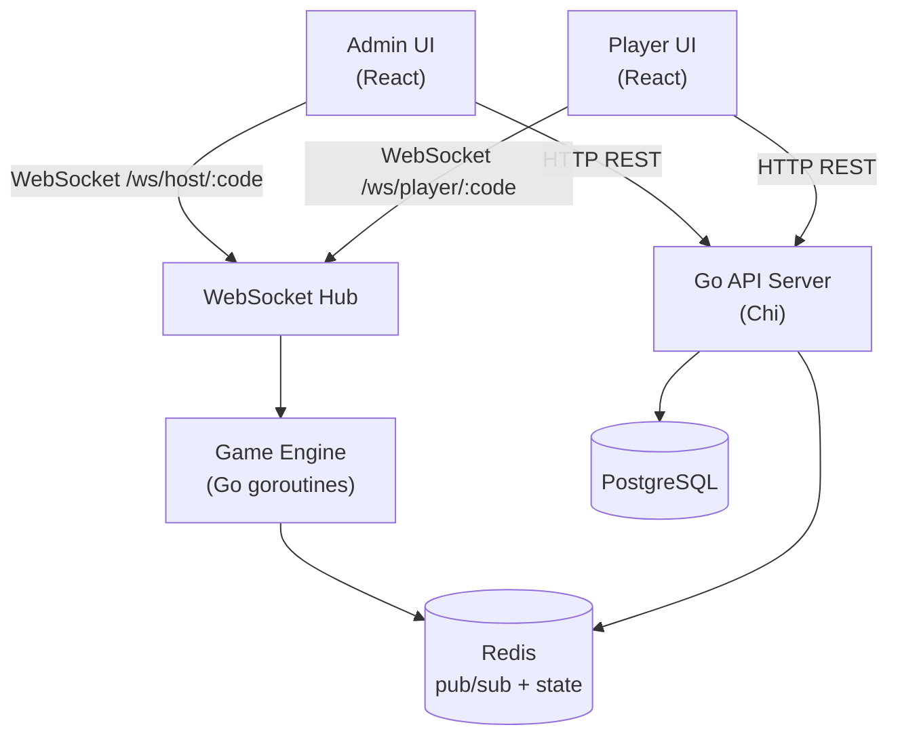

# Architecture

## System Design



## Game Flow

1. Admin creates a quiz (questions + multiple-choice options)
2. Admin starts a session — gets a 6-digit room code
3. Players go to the join URL, enter the code + their name
4. Admin broadcasts questions one at a time with a countdown timer
5. When time expires or all players answer:
   - Players see "Correct / Incorrect" for 3 seconds (with points earned)
   - Admin screen shows the correct answer for 3 seconds
6. Leaderboard is shown to all (admin + players) after each question
7. After the final question, a podium (top 3) is displayed to everyone

### State Machine

```
waiting → active → question_open → answer_reveal (3s) → leaderboard → next_question
                                                                          ↓ (after last)
                                                                       game_over → podium
```

### Scoring

```
points = BasePoints × (1 - elapsed / timeLimit)
BasePoints = 1000, minimum = 0
```

Faster correct answers earn more points. Wrong answers earn 0.

## Project Structure

```
Iftaroot/
├── backend/
│   ├── cmd/server/         # Entry point
│   ├── internal/
│   │   ├── config/         # Env config loader
│   │   ├── db/             # DB + Redis connection, migrations
│   │   ├── game/           # Scoring algorithm, game engine
│   │   ├── handlers/       # HTTP + WebSocket handlers
│   │   ├── hub/            # WebSocket hub (room management)
│   │   ├── middleware/     # JWT auth middleware
│   │   └── models/         # Domain models
│   └── migrations/         # SQL migration files
├── frontend/
│   └── src/
│       ├── api/            # Axios client + React Query
│       ├── components/     # Reusable UI components
│       ├── hooks/          # Custom React hooks (useWebSocket etc.)
│       ├── pages/          # Route-level page components
│       ├── stores/         # Zustand state stores
│       └── types/          # TypeScript type definitions
├── Dockerfile.backend
├── Dockerfile.frontend
├── docker-compose.yml
└── .github/workflows/ci.yml
```

## WebSocket API

### Host connects to

```
ws://host/ws/host/:sessionCode
Authorization: Bearer <jwt>
```

### Player connects to

```
ws://host/ws/player/:sessionCode?player_id=<id>&name=<name>
```

### Message Types

| Type              | Direction       | Description                            |
|-------------------|-----------------|----------------------------------------|
| `player_joined`   | server → all    | New player joined the lobby            |
| `player_left`     | server → all    | Player disconnected                    |
| `game_started`    | server → all    | Game has started                       |
| `question`        | server → all    | New question with options + timer      |
| `answer_submitted`| client → server | Player submits their answer            |
| `answer_reveal`   | server → all    | Correct answer revealed + points       |
| `leaderboard`     | server → all    | Updated leaderboard after question     |
| `game_over`       | server → all    | All questions complete                 |
| `podium`          | server → all    | Top 3 players podium                   |

All messages follow the format:

```json
{ "type": "<MessageType>", "payload": { ... } }
```
